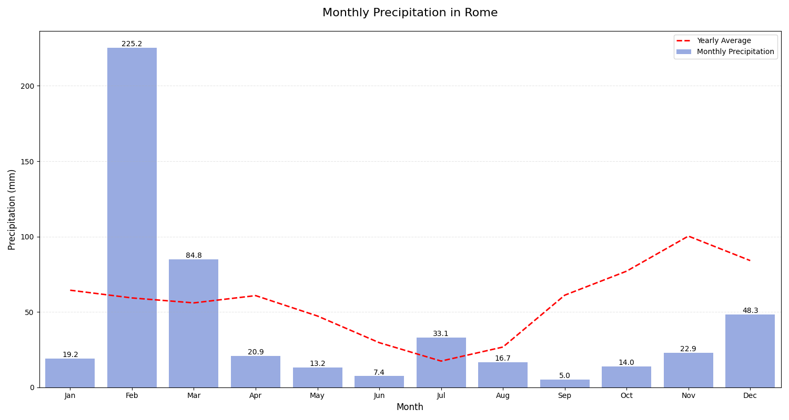
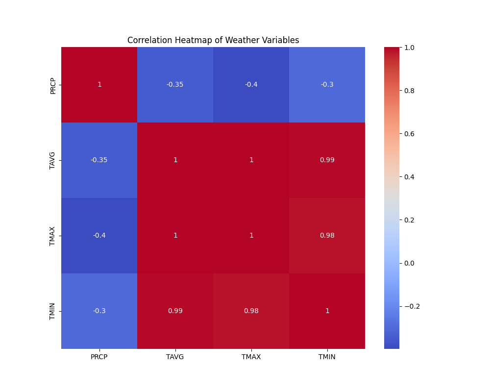
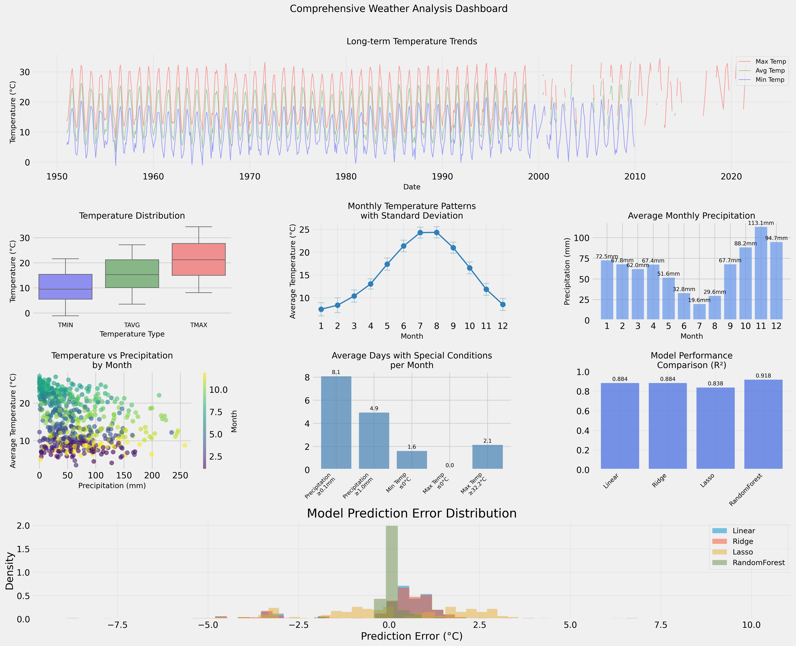

# Rome Weather Analysis Project

## Overview

A comprehensive analysis of Rome's historical weather patterns from 1950 to 2022, examining temperature trends, precipitation patterns, and climate change indicators through statistical analysis and machine learning approaches.

## Quick Links

- [Interactive Dashboard](https://roma-weather-analysis.streamlit.app/)
- [Complete Jupyter Notebook](./Roma_Weather_Analysis.ipynb)
- [Dataset](./Roma_weather.csv)

## Key Findings

### Temperature Trends and Patterns

The analysis reveals significant temperature patterns in Rome:
- Clear seasonal temperature cycles
- Long-term warming trend visible in the data
- Monthly temperature distribution shows peak temperatures in July-August
- Significant temperature variations between seasons

### Precipitation Analysis

Key precipitation findings include:
- Highest rainfall typically occurs in February (~225mm)
- Driest month is September (~5mm)
- Clear seasonal precipitation pattern
- Notable year-to-year variability in rainfall amounts

### Variable Correlations

The correlation analysis shows:
- Strong positive correlation (0.99) between average and maximum temperatures
- Strong positive correlation (0.98) between average and minimum temperatures
- Weak negative correlation (-0.35) between precipitation and temperature variables

### Comprehensive Analysis Dashboard

The dashboard provides:
- Long-term temperature trends
- Temperature distribution analysis
- Monthly temperature patterns with standard deviation
- Average monthly precipitation
- Temperature vs. precipitation relationships
- Special weather conditions frequency
- Model performance comparisons
- Prediction error distributions

## Technical Details

### Analysis Techniques
- Time series analysis
- Seasonal decomposition
- Statistical testing (Mann-Kendall, Shapiro-Wilk)
- Machine learning models (Random Forest, Linear Regression)
- Data visualization using matplotlib, seaborn

### Model Performance
The analysis included multiple machine learning models:
- Linear Regression (R² = 0.884)
- Ridge Regression (R² = 0.884)
- Lasso Regression (R² = 0.838)
- Random Forest (R² = 0.918)

## Data Source
The analysis uses the 'Roma_weather.csv' dataset, containing daily weather records from 1950 to 2022, including:
- Average temperature (TAVG)
- Maximum temperature (TMAX)
- Minimum temperature (TMIN)
- Precipitation (PRCP)